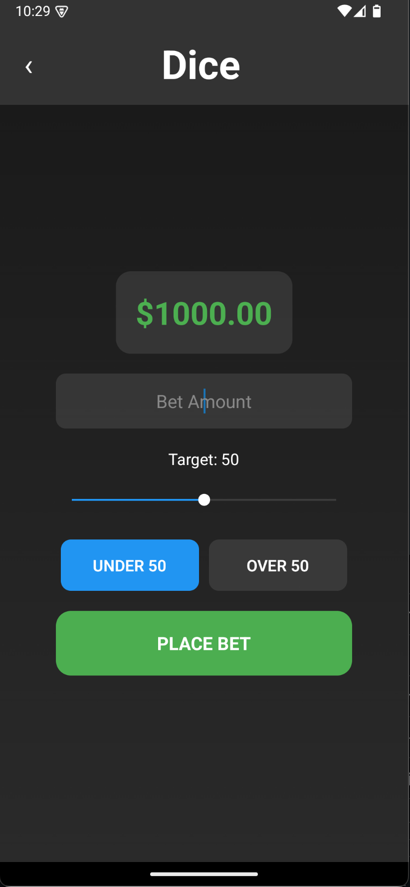

# ReactNative Dice 🎲

<p align="center">
  
</p>

A sleek, modern mobile application built with React Native and Expo that simulates a dice gambling game. Place bets, customize your target numbers, and track your winnings in real-time—all within an elegant, professionally designed UI.

## 📱 App Preview

<p align="center">
  
  <br>
  <em>The ReactNative Dice app features a dark-themed UI with intuitive betting controls</em>
</p>

## 🎮 Overview

ReactNative Dice allows users to:
- View their current bank balance in a clean, modern interface
- Place bets on a dice game using a customizable target and bet amount
- Choose between betting "UNDER" or "OVER" a target number
- Receive instant visual feedback about the outcome of each bet
- Track betting history in a live, scrollable feed that updates in real-time

The app leverages modern React Native patterns and Expo tools to provide a seamless cross-platform experience.

## ✨ Features

- **Intuitive Two-Screen Navigation:**
  Smooth transitions between the Home screen (Bank overview) and the Gamble screen (betting interface) using Expo Router.

- **Efficient State Management:**
  A custom React Context (`BankContext`) maintains the current balance and betting history across the entire app.

- **Dynamic Betting Experience:**
  - Set custom bet amounts with a clean numeric input
  - Fine-tune your target number with a responsive slider
  - Toggle between "UNDER" and "OVER" betting options with visual feedback
  - Calculated odds and payouts based on your selected target

- **Real-time Feedback:**
  Immediate visual updates and notifications about wins/losses and updated balances.

- **Polished UI/UX:**
  - Elegant dark-themed gradient backgrounds
  - Custom headers and status bars for a premium look
  - Responsive layouts that adapt to different screen sizes
  - Smooth animations and transitions

- **Technical Excellence:**
  - TypeScript for type safety and better developer experience
  - Portrait mode lock for optimal gameplay
  - Gradient backgrounds for visual appeal
  - Custom slider component for intuitive target selection

## 🛠️ Technologies Used

- **React Native:** Core framework for building the mobile application
- **TypeScript:** For type-safe code and enhanced developer experience
- **Expo:** Development platform for building and deploying React Native apps
- **Expo Router:** For seamless navigation between screens
- **React Context API:** For global state management
- **expo-linear-gradient:** For creating beautiful gradient backgrounds
- **expo-screen-orientation:** For locking the screen to portrait mode
- **@react-native-community/slider:** For the interactive target selector
- **ToastAndroid:** For providing quick feedback messages on Android

## 📋 Installation & Setup

Follow these steps to get the app running on your local machine:

1. **Clone the repository**
   ```bash
   git clone https://github.com/kolin-nielson/ReactNativeDice.git
   cd ReactNativeDice
   ```

2. **Install dependencies**
   ```bash
   npm install
   # or
   yarn install
   ```

3. **Start the development server**
   ```bash
   npm start
   # or
   yarn start
   ```

4. **Run on a device or emulator**
   - For Android:
     ```bash
     npm run android
     # or
     yarn android
     ```
   - For iOS:
     ```bash
     npm run ios
     # or
     yarn ios
     ```

## 🎯 How to Play

1. **Start with your initial balance** of $1,000
2. **Enter your bet amount** in the input field
3. **Adjust the target number** using the slider (1-99)
4. **Choose your bet type**:
   - **UNDER**: Win if the dice roll is less than your target
   - **OVER**: Win if the dice roll is greater than your target
5. **Place your bet** and see the result immediately
6. **Check your updated balance** and betting history

The payout multiplier is calculated based on probability:

- For UNDER bets: `(100 / target) * 0.95`
- For OVER bets: `(100 / (100 - target)) * 0.95`

The lower the probability of winning, the higher the potential payout!

## 🔄 Game Mechanics

The game simulates a 100-sided dice (0-99):

- If you bet UNDER 50, you win when the roll is less than 50
- If you bet OVER 50, you win when the roll is greater than 50
- The house edge is 5% (the 0.95 multiplier in the payout calculation)
- Moving the target slider changes both your odds of winning and the potential payout


## 📸 Screenshots

<p align="center">
  
</p>

## 🙏 Acknowledgments

- Icons and design inspiration from various sources
- Built with React Native and Expo
- Special thanks to all contributors
